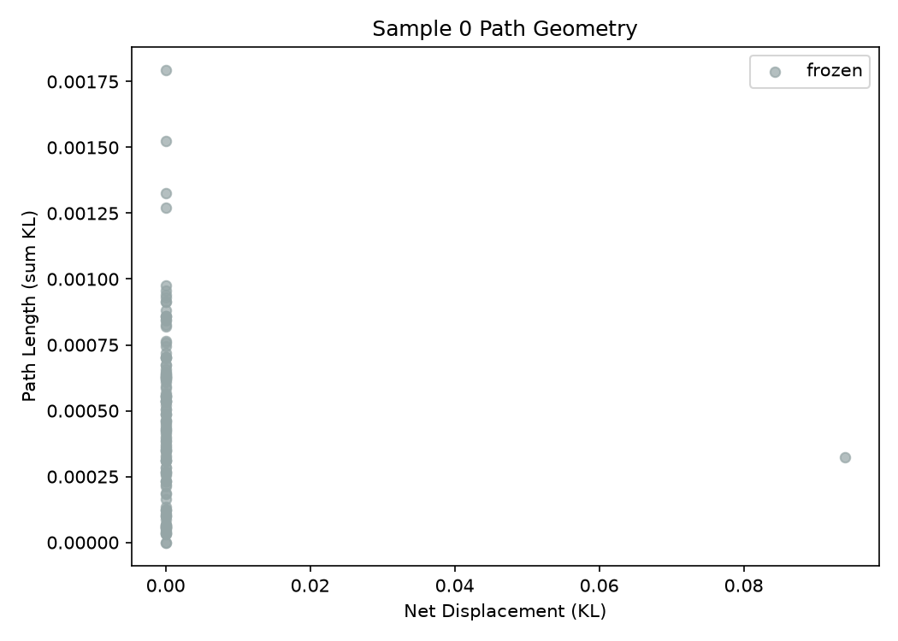
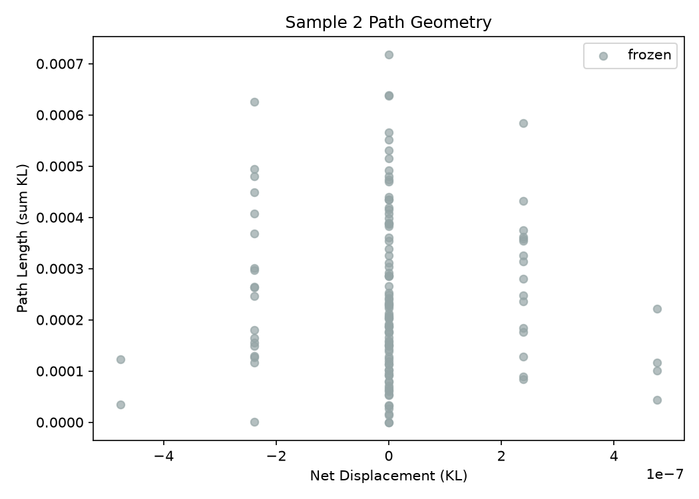
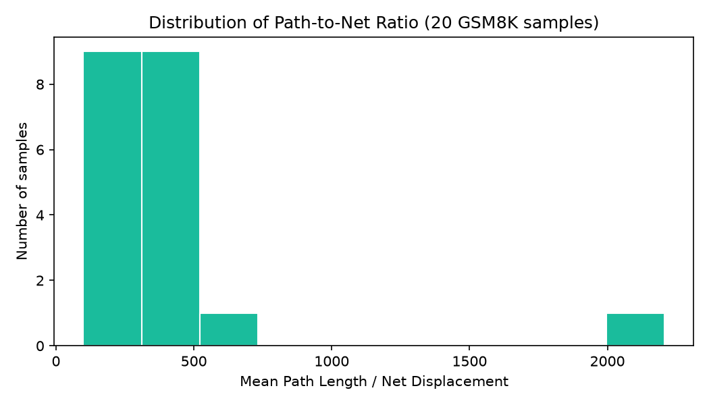
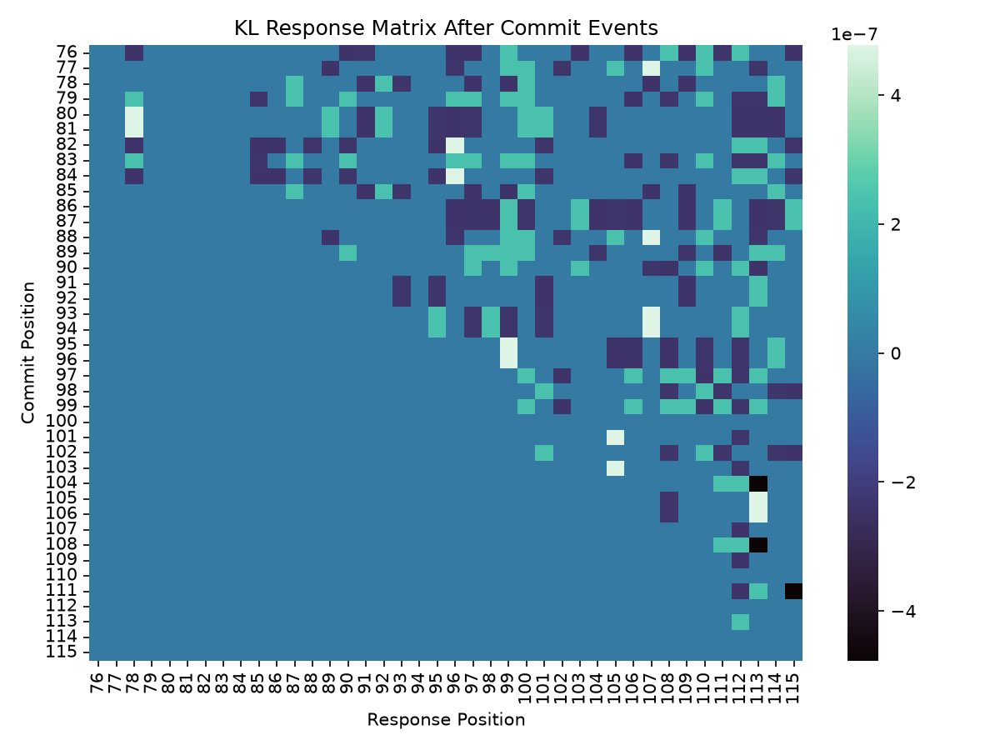
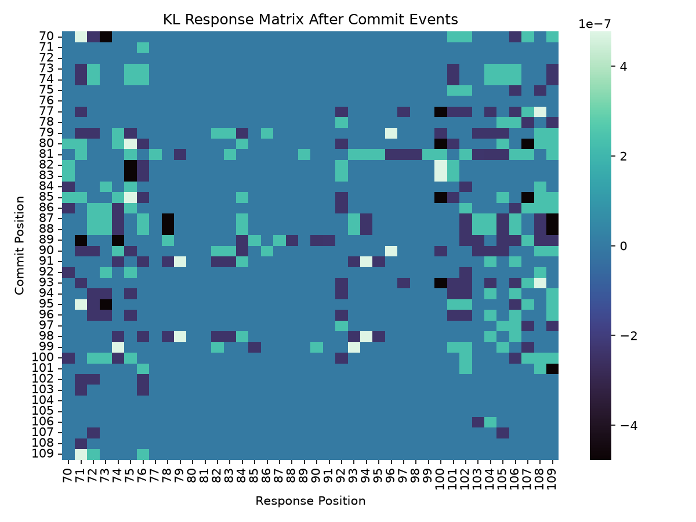
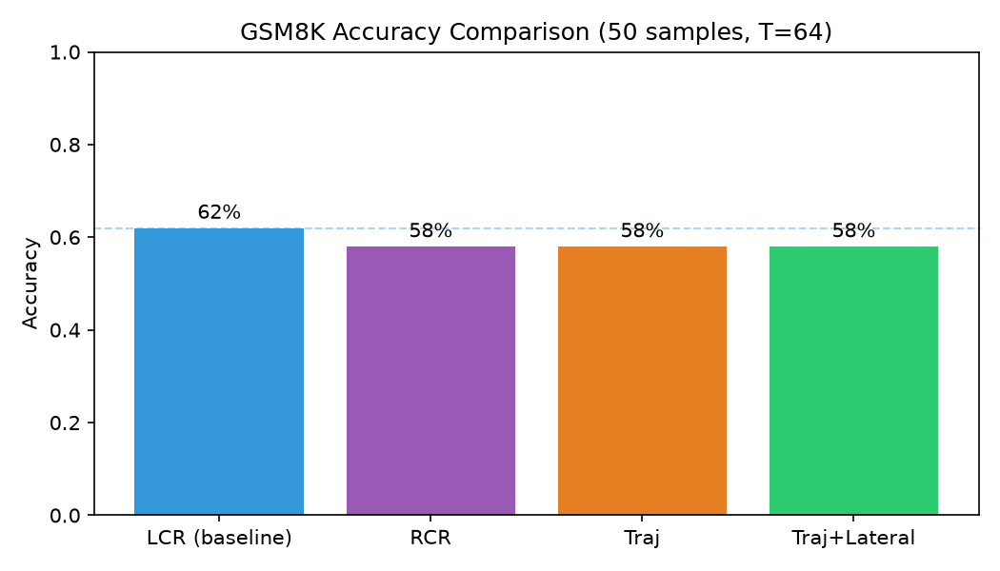
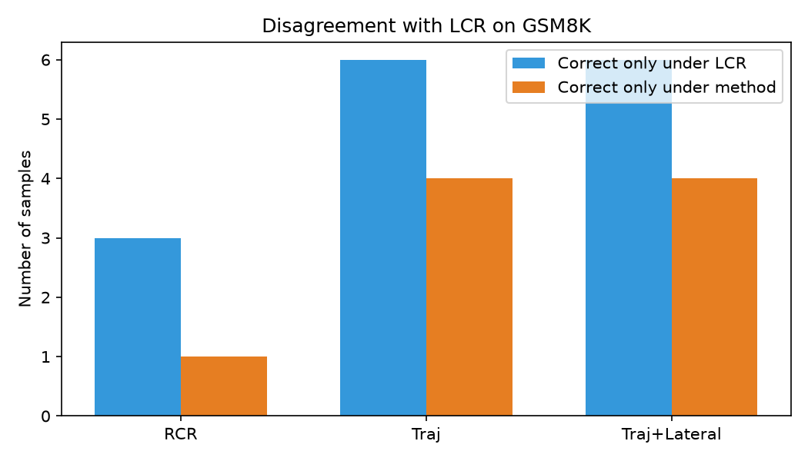

# DLM 分布轨迹实验：阶段性报告

> 日期：2026-07-09  
> 项目目录：`/root/autodl-tmp/dlm-seq-flow`  
> 模型：LLaDA-8B-Instruct  
> 范围：纯测试时调度，不改模型权重

---

## 1. 核心结论（先说清楚）

到目前为止，**还没有找到能稳定超过基线的测试时方法**。在 GSM8K（50 题）上：

| 方法 | 准确率 | 相对基线 |
|------|--------|----------|
| 低置信度重掩码（基线） | **62%** | — |
| 历史最高置信度 | 58% | -4 个百分点 |
| 轨迹收敛调度 | 58% | -4 个百分点 |
| 轨迹 + 横向解耦 | 58% | -4 个百分点 |

观测侧有两个更有价值的发现：

1. **落定后的跨位置响应矩阵非常稀疏**（约 99.98% 的位置对几乎无响应），说明“谁落定会影响谁”这件事在原则上可测，但当前度量下信号极弱。
2. **多数位置的净位移接近 0，但路径长度不为 0**，说明分布在时间上有“走动”，却很少形成稳定的方向性收敛——这解释了为什么简单用路径几何量做调度，容易伤到基线。

一句话：方向仍然成立，但**第一版调度器把弱信号用得太硬**，还没把“诊断”转成真正有用的“决策”。

---

## 2. 问题设定与研究假设回顾

### 2.1 我们在研究什么

掩码扩散语言模型每一步都会对所有仍遮蔽位置给出完整候选分布。标准采样器只把其中一部分坍缩成词元，其余分布直接丢掉。我们的主张是：

- **纵向**：同一位置的分布轨迹，记录候选在不同可见上下文下是否稳定；
- **横向**：某次落定之后，其他位置分布如何变化，记录位置间依赖。

这两类信息都应来自分布本身，而不是手工堆很多特征。

### 2.2 关于“循环论证”的澄清

自回归模型的思维链之所以有效，不是因为模型“自己证明自己”，而是因为**每一步输出改变了下一步的输入**。扩散模型里，每次落定一个词元，同样改变了后续前向计算的条件。因此：

- 轨迹上的多次分布，是同一位置在不同条件下被反复查询的结果；
- 这不是循环，而是**约束外置后的级联**；
- 真正修不了的，是模型在所有条件下都自信且错误的系统性错误。

### 2.3 待检验假设

| 编号 | 假设 | 当前状态 |
|------|------|----------|
| H1 | 路径长度 / 净位移 能区分收敛、振荡、冻结 | **部分证伪（度量失效）** |
| H2 | 落定后的响应矩阵稀疏，强耦合对不应同步落定 | **方向支持，信号过弱** |
| H3 | 用轨迹结构做调度，可超过低置信度基线 | **当前版本未成立** |
| H4 | 中间步曾正确、最终却错的比例，给出测试时修正天花板 | **尚未系统测量** |

---

## 3. 实验设置

- 模型：`/root/autodl-tmp/model/LLaDA/instruct`
- 数据：GSM8K、MBPP，保存在 `/root/autodl-tmp/dataset/`
- 生成配置（GSM8K）：步数 64，生成长度 128，块长 128，温度 0
- MBPP 修正后配置：步数 = 生成长度 = 256（否则去噪不完整，准确率会假性为 0）
- 结果目录：`results/round0_baseline`、`results/round1_observation`、`results/round2_methods`

---

## 4. 基线结果

### 4.1 GSM8K

50 题上，低置信度重掩码准确率 **62%**（31/50）。这是后续所有方法的对照点。

### 4.2 MBPP 的一次重要踩坑

第一轮 MBPP 得到 0%，不是模型完全不会写代码，而是配置错误：

- 当 `步数 < 生成长度` 时，生成区会残留大量掩码；
- 解码出来的代码残缺，测试必然失败。

修正原则：**完整去噪要求步数至少等于生成长度**。后续 MBPP 评估应使用 256/256 配置；该轮仍在补跑中，本报告暂不以 MBPP 准确率下结论。

---

## 5. 观测研究：假设检验

观测在 20 道 GSM8K 上，用标准低置信度调度，记录每步分布轨迹。

### 5.1 纵向：路径几何

图注：Sample 0 的路径几何。横轴为净位移，纵轴为路径长度。绝大多数点净位移接近 0，少数点有明显净位移。

图注：Sample 2。净位移尺度约 \(10^{-7}\)，路径长度约 \(10^{-4}\)，说明“走了很多路，却几乎没到新地方”。

**解读：**

- 平均路径/净位移比约 **410**（中位数约 335），说明大量位置在做无效往返；
- 但第一版分类阈值把几乎所有位置都标成“冻结”（2560/2560），这是**度量与阈值失效**，不能据此说真实世界里没有收敛/振荡；
- 因此 H1 目前只能说：路径几何里确实有结构，但我们还没找到能稳定区分三类轨迹、并预测对错的阈值。

图注：20 个样本的平均路径/净位移比分布。

### 5.2 横向：落定响应矩阵

图注：Sample 0 的落定响应热图。整体极稀疏，非零响应量级约 \(10^{-7}\)。

图注：Sample 2。可见局部簇状响应，但整体仍接近全零。

**解读：**

- 耦合稀疏度约 **99.98%**，平均耦合强度约 \(1.6\times10^{-5}\)；
- H2 的“稀疏性”得到支持：大多数落定不会扰动大多数位置；
- 但信号太弱，直接拿来做“禁止同步落定”的硬约束，几乎等价于什么都没做——这也解释了“轨迹 + 横向解耦”与纯轨迹准确率完全相同（都是 58%）。

---

## 6. 方法对比与失败分析

### 6.1 准确率对比

图注：GSM8K 上四种方法的准确率。基线最高。

### 6.2 与基线的分歧

图注：相对基线，各方法“独对”与“独错”的样本数。轨迹方法独错 6 题、独对 4 题，净损失 2 题。

### 6.3 为什么第一版轨迹调度没有超过基线

结合观测与分歧样本，失败原因可以收成三点：

1. **信号太弱，决策太硬**  
   振荡惩罚、强制延后等规则，在轨迹分类本身不可靠时，会把本来该按置信度落定的位置拖慢或打乱。

2. **把“诊断量”直接当成“排序量”**  
   路径比、翻转次数更适合解释“发生了什么”，不一定适合每一步直接替换置信度排序。基线的单步置信度虽然短视，但在当前模型上校准得更好。

3. **横向约束几乎空转**  
   响应矩阵稀疏且量级极小，解耦阈值几乎触发不到；所以横向版本与纵向版本结果完全一致。

这并不否定“分布轨迹是内部状态”的想法，只说明：**从状态到动作，还缺一层更稳的映射**——更像“何时相信轨迹、何时回退到置信度”，而不是全程用轨迹覆盖基线。

---

## 7. 对原有思考的修正

原先的叙事里，有几处需要收紧：

1. **“去噪时间轴天然是思考循环”**  
   对旁观者成立，对模型本身不成立：下一步前向并不读取上一步的分布，只读取已落定的离散词元。因此思考发生在采样器对可见性的控制里，而不是模型隐藏状态的累积里。

2. **“历史分布可以直接融合”**  
   观测显示多数位置净位移极小，简单融合或强行用历史几何量排序，容易引入噪声。更合理的用法是**条件触发**：只在轨迹形态清晰时介入。

3. **“横向依赖可从单步边缘分布读出”**  
   不能。依赖只能从落定前后的响应里读。我们测到了稀疏响应，但还没测到足够强、足够可复用的耦合图。

4. **与思维链的类比仍然成立，但收益机制不同**  
   思维链靠改变输入；扩散调度也靠改变输入。差别在于：思维链强制写入中间步骤，扩散调度可以选择写谁、何时写、是否回滚。第一版方法还没有把这种自由度用对。

---

## 8. 当前进度与缺口

| 项目 | 状态 |
|------|------|
| 环境与 LLaDA 推理 | 完成 |
| GSM8K 基线 | 完成（62%） |
| 分布轨迹观测与可视化 | 完成（20 样本） |
| 第一版轨迹 / 横向方法 | 完成，未超过基线 |
| MBPP 修正配置评估 | 进行中 |
| 中间步正确但最终错误的天花板 | 未测 |
| 轨迹类型与最终对错的相关性 | 未可靠测出（分类器失效） |
| 能显著超过基线的测试时方法 | **尚未得到** |

---

## 9. 下一步应怎么走（仍围绕原逻辑）

不建议继续堆更多启发式权重。更符合原思路的路线是：

1. **先修度量，再谈调度**  
   用置信度轨迹、候选身份翻转、近期稳定性，重新定义收敛/振荡/冻结，并检验它们与最终对错的相关性。没有相关性，就不该进调度器。

2. **把轨迹从“主排序”降为“门控”**  
   默认仍用低置信度基线；仅当某位置被判定为明确振荡时延后，明确收敛时提前。目标是少改、只改高把握位置。

3. **横向先做观测，再做约束**  
   提高响应度量的灵敏度（例如只看 top 候选变化、或只在落定事件附近窗口统计），确认强耦合对是否与错误共现，再决定是否解耦。

4. **补测天花板**  
   统计“中间某步答案区已正确、最终却错”的比例。若该比例很小，测试时修正空间本身就有限。

---

## 10. 文件索引

- 基线：`results/round0_baseline/`
- 观测图与统计：`results/round1_observation/`
- 方法结果：`results/round2_methods/`
- 本报告配图：`results/report_assets/`
- 代码：`src/samplers.py`、`src/analysis.py`、`src/runner.py`

---

*本报告记录的是阶段性事实与反思，不是最终方法声明。在没有稳定超过基线之前，任何“新调度器”都应视为待证假设，而不是结论。*
